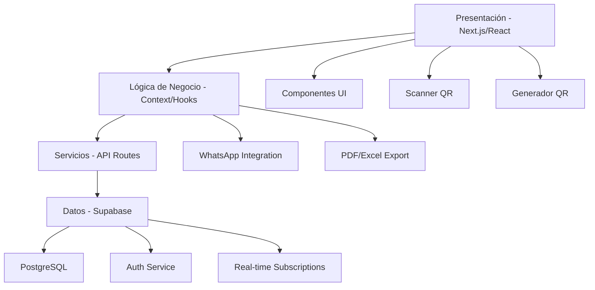
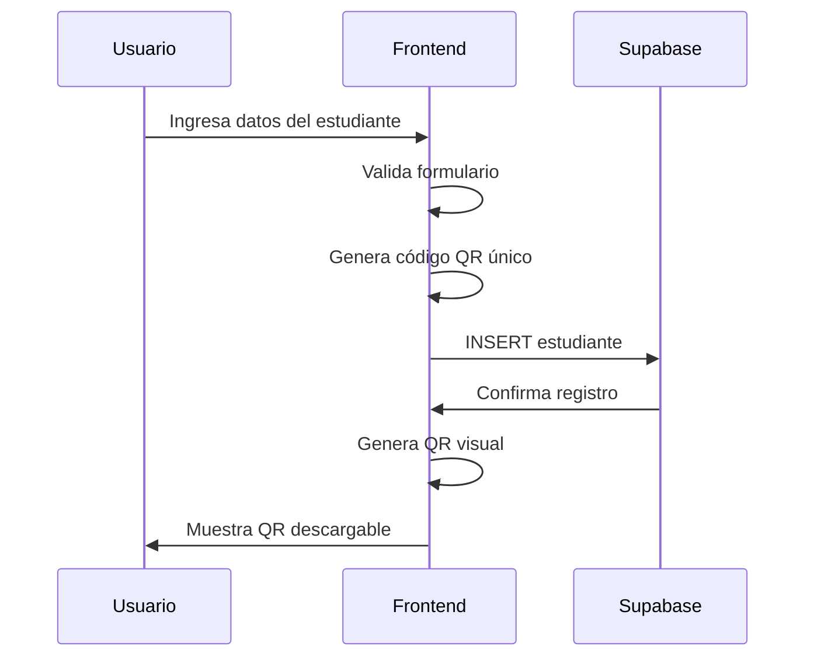
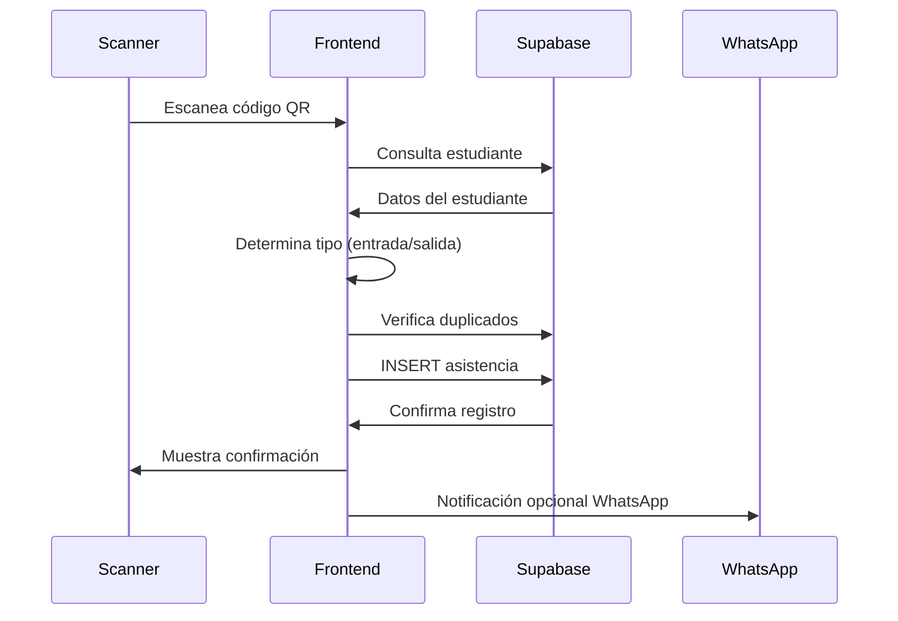
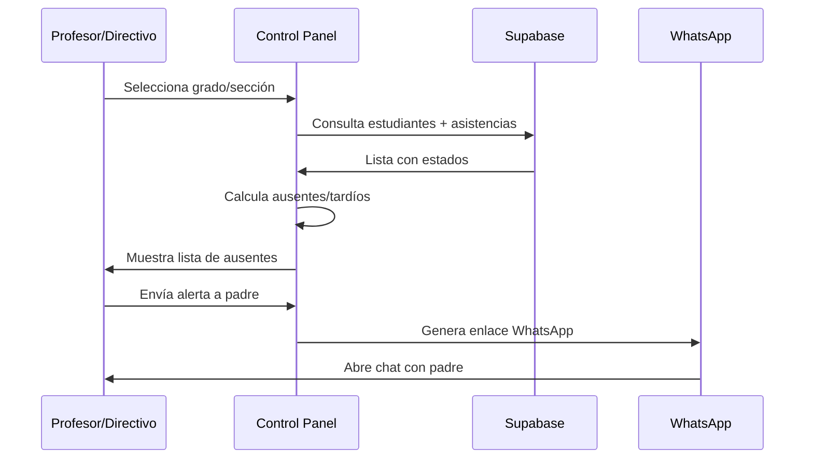

# 📚 EduCheck Fe y Ciencia - Documentación Técnica Integral

## 🎯 Resumen Ejecutivo

**EduCheck Fe y Ciencia** es un sistema integral de gestión de asistencia escolar desarrollado con tecnologías web modernas, diseñado específicamente para instituciones educativas que requieren un control eficiente y automatizado de la asistencia estudiantil mediante códigos QR únicos.

### Datos del Proyecto

- **Nombre**: EduCheck Fe y Ciencia
- **Tipo**: Sistema de Control de Asistencia Escolar
- **Tecnología Principal**: Next.js 15.4.6 + React 19.1
- **Base de Datos**: Supabase (PostgreSQL)
- **Interfaz**: Responsive Web Application (PWA Ready)
- **Estado**: En desarrollo activo
- **Licencia**: Privada - Colegio Fe y Ciencia

---

## 🏗️ Arquitectura del Sistema

### Stack Tecnológico

#### Frontend

- **Framework**: Next.js 15.4.6 con App Router
- **Runtime**: React 19.1 con TypeScript 5.x
- **Styling**: Tailwind CSS 4.x
- **Animaciones**: Framer Motion 12.23.12
- **Componentes UI**: Lucide React (iconos)
- **Notificaciones**: React Hot Toast
- **Gráficos**: Recharts 3.1.2

#### Backend & Base de Datos

- **BaaS**: Supabase (Backend as a Service)
- **Base de Datos**: PostgreSQL (via Supabase)
- **Autenticación**: Supabase Auth
- **Almacenamiento**: Supabase Storage
- **Real-time**: Supabase Realtime

#### Librerías Especializadas

- **QR Scanning**: html5-qrcode 2.3.8
- **QR Generation**: qrcode 1.5.4
- **PDF Export**: jsPDF 3.0.1 + jsPDF-AutoTable 5.0.2
- **Excel Export**: xlsx 0.18.5

### Arquitectura de Capas



---

## 🎭 Módulos y Funcionalidades

### 1. **Módulo de Autenticación**

- **Ubicación**: `src/app/page.tsx`
- **Funcionalidades**:
  - Login con email/password
  - Recuperación de contraseña
  - Sesión persistente con localStorage
  - Validación de formularios en tiempo real
  - Redirección automática post-autenticación

### 2. **Dashboard Principal**

- **Ubicación**: `src/app/dashboard/page.tsx`
- **Características**:
  - Interfaz responsive multi-dispositivo
  - 7 módulos especializados integrados
  - Navegación por tabs dinámica
  - Context API para estado global
  - Lazy loading de componentes

#### 2.1 **Módulo Resumen (Overview)**

- **Archivo**: `src/components/Dashboard/OverviewTab.tsx`
- **Funciones**:
  - Dashboard ejecutivo con KPIs
  - Estadísticas en tiempo real
  - Gráficos de asistencia
  - Navegación rápida a otros módulos

#### 2.2 **Módulo de Estudiantes (Alumnos)**

- **Archivo**: `src/components/Dashboard/AlumnosTab.tsx`
- **Funciones**:
  - Listado completo de estudiantes
  - Vista de cuadrícula y lista
  - Filtrado por grado, sección, estado
  - Búsqueda en tiempo real
  - Modal de detalles de estudiante

#### 2.3 **Módulo de Registro de Estudiantes**

- **Archivo**: `src/components/QRGenerator.tsx`
- **Funciones**:
  - Registro de nuevos estudiantes
  - Generación automática de códigos QR únicos
  - Validación de datos duplicados
  - Vista previa del QR generado
  - Descarga de códigos QR

#### 2.4 **Módulo Scanner QR**

- **Ubicación**: `src/components/Scanner/`
- **Componentes**:
  - `EnhancedQRScanner.tsx`: Scanner principal
  - `ScannerCamera.tsx`: Control de cámara
  - `StudentConfirmation.tsx`: Confirmación de asistencia
  - `RecentRegistrations.tsx`: Registros recientes
- **Funciones**:
  - Escaneo QR en tiempo real
  - Detección automática de tipo (entrada/salida)
  - Prevención de registros duplicados
  - Soporte multi-cámara
  - Confirmación visual del estudiante

#### 2.5 **Módulo de Registros de Asistencia**

- **Archivo**: `src/components/Dashboard/AsistenciaTab.tsx`
- **Funciones**:
  - Historial completo de asistencias
  - Filtrado por fechas, tipos, grados
  - Vista de lista y cuadrícula
  - Exportación de reportes (PDF, Excel, CSV)
  - Estadísticas de asistencia

#### 2.6 **Módulo de Control de Asistencia** ⭐

- **Archivo**: `src/components/Dashboard/ControlAsistenciaTab.tsx`
- **Funciones Principales**:
  - **Vista Profesor**: Control por grado y sección específica
  - **Vista Directivo**: Acceso a todos los grados
  - Navegación dinámica por grado/sección
  - Identificación de ausentes en tiempo real
  - Sistema de alertas configurables
  - Envío manual de notificaciones WhatsApp
  - Configuración de horarios (entrada: 8:00, salida: 15:15)
  - Tiempo de gracia: 20 minutos
  - Alertas automáticas después de 20 minutos

#### 2.7 **Módulo de Estadísticas**

- **Archivo**: `src/components/Dashboard/EstadisticasTab.tsx`
- **Funciones**:
  - Gráficos de asistencia por período
  - Métricas de rendimiento
  - Comparativas por grado/sección
  - Tendencias históricas

### 3. **Sistema de Notificaciones WhatsApp**

- **Hook**: `src/hooks/useWhatsAppNotification.ts`
- **Componentes**:
  - `WhatsAppModal.tsx`: Modal de confirmación
  - `QuickWhatsAppNotification.tsx`: Notificación rápida
- **API Route**: `src/app/api/whatsapp/route.ts`
- **Funciones**:
  - Generación de enlaces WhatsApp Web
  - Mensajes personalizables por contexto
  - Integración con API de WhatsApp Business (preparado)
  - Envío manual a padres de familia

---

## 🗄️ Esquema de Base de Datos

### Tabla: `alumnos`

```sql
CREATE TABLE alumnos (
  id UUID PRIMARY KEY DEFAULT gen_random_uuid(),
  nombres VARCHAR NOT NULL,
  apellidos VARCHAR NOT NULL,
  dni VARCHAR UNIQUE NOT NULL,
  nombres_apoderado VARCHAR NOT NULL,
  codigo_qr VARCHAR UNIQUE NOT NULL,
  contacto_padres VARCHAR,
  grado INTEGER NOT NULL,
  seccion VARCHAR NOT NULL,
  created_at TIMESTAMP DEFAULT NOW(),
  updated_at TIMESTAMP DEFAULT NOW()
);
```

### Tabla: `asistencias`

```sql
CREATE TABLE asistencias (
  id UUID PRIMARY KEY DEFAULT gen_random_uuid(),
  id_alumno UUID REFERENCES alumnos(id) ON DELETE CASCADE,
  hora TIMESTAMP DEFAULT NOW(),
  tipo VARCHAR CHECK (tipo IN ('entrada', 'salida')),
  created_at TIMESTAMP DEFAULT NOW()
);
```

### Índices y Optimizaciones

```sql
-- Índices para mejores consultas
CREATE INDEX idx_asistencias_alumno_fecha ON asistencias(id_alumno, DATE(hora));
CREATE INDEX idx_asistencias_fecha_tipo ON asistencias(DATE(hora), tipo);
CREATE INDEX idx_alumnos_grado_seccion ON alumnos(grado, seccion);
CREATE INDEX idx_alumnos_codigo_qr ON alumnos(codigo_qr);
```

---

## 🔄 Flujo de Datos y Procesos

### Workflow de Registro de Estudiantes



### Workflow de Registro de Asistencia



### Workflow de Control de Asistencia



---

## 🔒 Seguridad y Autenticación

### Modelo de Seguridad

#### Autenticación

- **Provider**: Supabase Auth
- **Método**: Email/Password con JWT
- **Persistencia**: Sesión en localStorage
- **Expiración**: Configurable en Supabase

#### Autorización

- **Nivel de aplicación**: Context-based access control
- **Row Level Security (RLS)**: Configurado en Supabase
- **Roles**:
  - Profesor (acceso limitado a su grado/sección)
  - Directivo (acceso completo)
  - Administrador (gestión completa)

#### Políticas de Seguridad RLS

```sql
-- Política para tabla alumnos
CREATE POLICY "Users can view students" ON alumnos
FOR SELECT USING (auth.role() = 'authenticated');

-- Política para tabla asistencias
CREATE POLICY "Users can insert attendance" ON asistencias
FOR INSERT WITH CHECK (auth.role() = 'authenticated');

CREATE POLICY "Users can view attendance" ON asistencias
FOR SELECT USING (auth.role() = 'authenticated');
```

#### Validaciones de Entrada

- **Frontend**: React Hook Form + Zod schemas
- **Backend**: Supabase constraints + triggers
- **QR Codes**: Validación de formato único
- **Duplicados**: Constraints de base de datos

---

## 📊 Manejo de Estado y Context

### Context API Structure

```typescript
// src/contexts/DashboardContext.tsx
interface DashboardContextType {
  // Estado global
  alumnos: Alumno[];
  asistencias: Asistencia[];
  estadisticas: EstadisticasGenerales;
  loading: boolean;
  error: string | null;

  // Funciones
  fetchAlumnos: () => Promise<void>;
  fetchAsistenciasHoy: () => Promise<void>;
  calcularEstadisticas: () => void;
}
```

### Hooks Personalizados

- **useWhatsAppNotification**: Gestión de notificaciones
- **useScannerLogic**: Lógica del scanner QR
- **useDashboard**: Acceso al contexto global

### Estado Local vs Global

- **Global**: Datos de estudiantes, asistencias, estadísticas
- **Local**: Estados de UI, formularios, modales
- **Persist**: Preferencias de usuario, configuraciones

---

## 📱 Integración WhatsApp

### Implementación Actual

- **Tipo**: WhatsApp Web Links
- **Formato**: `https://wa.me/PHONE?text=MESSAGE`
- **Codificación**: URL encoding para caracteres especiales
- **Personalización**: Mensajes por tipo de notificación

### Preparado para WhatsApp Business API

```typescript
// src/app/api/whatsapp/route.ts
export async function POST(req: NextRequest) {
  const { to, message } = await req.json();

  // Configurado para WhatsApp Business API
  const response = await fetch(
    `https://graph.facebook.com/v17.0/${PHONE_NUMBER_ID}/messages`,
    {
      method: "POST",
      headers: {
        Authorization: `Bearer ${ACCESS_TOKEN}`,
        "Content-Type": "application/json",
      },
      body: JSON.stringify({
        messaging_product: "whatsapp",
        to,
        type: "text",
        text: { body: message },
      }),
    }
  );
}
```

---

## 📄 Sistema de Reportes

### Formatos Disponibles

1. **PDF**: jsPDF con tablas automáticas
2. **Excel**: XLSX con formato profesional
3. **CSV**: Para análisis de datos

### Tipos de Reportes

- **Asistencia Diaria**: Por fecha específica
- **Asistencia Semanal**: Rango de 7 días
- **Asistencia Mensual**: Por mes completo
- **Por Grado/Sección**: Filtrado específico
- **Estudiantes Ausentes**: Lista de no asistentes

### Pipeline de Exportación

```typescript
// src/utils/reportExports.ts
export const exportarAExcel = (
  data: ReportData,
  stats: EstadisticasReporte
) => {
  const workbook = XLSX.utils.book_new();
  const worksheet = XLSX.utils.json_to_sheet(data.asistencias);
  XLSX.utils.book_append_sheet(workbook, worksheet, "Asistencias");
  XLSX.writeFile(
    workbook,
    `reporte_${new Date().toISOString().split("T")[0]}.xlsx`
  );
};
```

---

## 🎨 Interfaz de Usuario y UX

### Design System

- **Paleta de Colores**: Azul corporativo (#07aee1)
- **Tipografía**: Geist Sans + Geist Mono
- **Componentes**: Sistema modular con Tailwind CSS
- **Iconografía**: Lucide React (set completo)

### Responsive Design

- **Mobile First**: Diseño prioritario para móviles
- **Breakpoints**:
  - Mobile: < 768px
  - Tablet: 768px - 1024px
  - Desktop: > 1024px
- **PWA Ready**: Configurado para instalación

### Accesibilidad

- **ARIA Labels**: En componentes interactivos
- **Keyboard Navigation**: Soporte completo
- **Color Contrast**: WCAG 2.1 AA compliant
- **Screen Readers**: Compatibilidad básica

---

## 🔧 Configuración y Deployment

### Variables de Entorno

```bash
# .env.local
NEXT_PUBLIC_SUPABASE_URL=https://xxx.supabase.co
NEXT_PUBLIC_SUPABASE_ANON_KEY=xxx
WHATSAPP_ACCESS_TOKEN=xxx (futuro)
WHATSAPP_PHONE_NUMBER_ID=xxx (futuro)
```

### Scripts de Desarrollo

```json
{
  "dev": "next dev --turbopack",
  "build": "next build",
  "start": "next start",
  "lint": "next lint"
}
```

### Configuración PWA

```json
// public/manifest.json
{
  "name": "Sistema de Control de Asistencia Educheck",
  "short_name": "Educheck",
  "display": "standalone",
  "theme_color": "#07aee1",
  "start_url": "/dashboard"
}
```

---

## 📈 Métricas y Analytics

### KPIs del Sistema

- **Asistencia Diaria**: Porcentaje de presentes
- **Puntualidad**: Llegadas dentro del horario
- **Tendencias**: Comparativa semanal/mensual
- **Por Grado**: Estadísticas segmentadas

### Datos en Tiempo Real

- **Registros**: Via Supabase Realtime
- **Notificaciones**: Toast system
- **Estados**: Context updates automáticos

---

## 🚀 Roadmap y Funcionalidades Futuras

### En Desarrollo

- [ ] **API WhatsApp Business** integración completa
- [ ] **Notificaciones Push** para ausencias automáticas
- [ ] **Dashboard Administrativo** avanzado
- [ ] **Reportes Automáticos** programados

### Planificado

- [ ] **App Móvil Nativa** (React Native)
- [ ] **Integración con Sistema Académico**
- [ ] **ML para Predicción de Ausencias**
- [ ] **Geolocalización** para validar asistencia

---

## 🔍 Testing y Calidad

### Estrategia de Testing

- **Unit Tests**: Jest + React Testing Library
- **Integration Tests**: Cypress (planificado)
- **E2E Tests**: Playwright (planificado)
- **Manual Testing**: Protocolo definido

### Code Quality

- **TypeScript**: Strict mode habilitado
- **ESLint**: Configuración Next.js + Custom rules
- **Prettier**: Formateo automático
- **Husky**: Pre-commit hooks (planificado)

---

## 📚 Documentación Técnica

### Estructura de Archivos

```
src/
├── app/                    # Next.js App Router
│   ├── dashboard/          # Dashboard principal
│   ├── api/               # API Routes
│   └── globals.css        # Estilos globales
├── components/            # Componentes reutilizables
│   ├── Dashboard/         # Componentes del dashboard
│   └── Scanner/           # Sistema de scanner QR
├── contexts/              # React Context
├── hooks/                 # Custom hooks
├── types/                 # TypeScript definitions
└── utils/                 # Utilidades y helpers
```

### Convenciones de Código

- **Nomenclatura**: PascalCase para componentes, camelCase para funciones
- **Imports**: Absolute paths con @ alias
- **Props**: Interfaces tipadas obligatorias
- **Async**: Async/await preferido sobre Promises

---

## 🌟 Conclusión

EduCheck Fe y Ciencia representa una solución integral moderna para la gestión de asistencia escolar, combinando tecnologías web de vanguardia con procesos educativos tradicionales. El sistema está diseñado para escalabilidad, mantenibilidad y una experiencia de usuario excepcional.

### Fortalezas del Sistema

1. **Arquitectura Modular**: Facilita el mantenimiento y extensión
2. **Tecnología Moderna**: Stack actualizado y performante
3. **UX Centrada en el Usuario**: Interfaz intuitiva y responsive
4. **Seguridad Robusta**: Implementación de mejores prácticas
5. **Integración Flexible**: APIs preparadas para extensiones
6. **Documentación Completa**: Base sólida para desarrollo futuro

### Impacto Educativo

- **Automatización**: Reduce carga administrativa
- **Precisión**: Elimina errores manuales
- **Comunicación**: Mejora contacto escuela-familia
- **Análisis**: Datos para toma de decisiones
- **Escalabilidad**: Preparado para crecimiento institucional

El proyecto establece las bases para un ecosistema digital educativo completo, con potencial para expandirse hacia otros aspectos de la gestión escolar.

---

_Documento generado el 18 de agosto de 2025_  
_Versión del Sistema: 0.1.0_  
_Estado: En Desarrollo Activo_
